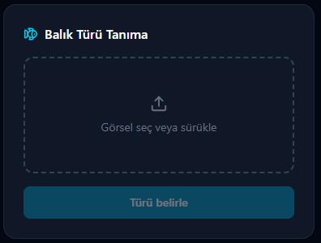
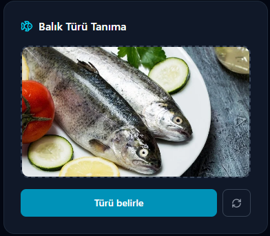
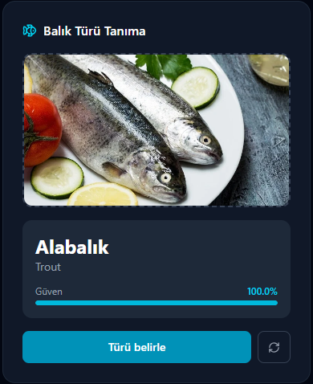

# Fish Species Classifier (API & Model Deployment) 🐟

An end-to-end Deep Learning application for classifying **9 fish species** from uploaded images.

The project covers the complete machine learning and deployment pipeline, including:

* Dataset cleaning and organization
* Transfer Learning with MobileNetV2
* FastAPI REST API for inference
* React frontend for image upload and prediction

---

# Features

* 9 fish species classification
* Transfer Learning using MobileNetV2
* Automatic dataset cleaning
* REST API built with FastAPI
* React web interface
* Prediction confidence scores
* TensorBoard support
* Early stopping
* Manual training interruption

---

# Project Structure

```text
fish-species-classifier/
├── main.py               # FastAPI endpoints & model inference
├── train.py              # Model training pipeline
├── datacleaning.py       # Dataset verification & cleaning
├── requirements.txt      # Project dependencies
├── frontend/             # React frontend
└── .gitignore            # Ignores datasets and trained model files
```

---

# Tech Stack

## Backend

* Python
* TensorFlow / Keras
* FastAPI
* Pillow
* NumPy
* Uvicorn

## Frontend

* React
* JavaScript
* Axios

---

# Installation

## Prerequisites

* Python 3.12 or lower
* Node.js (for the React frontend)

---

## 1. Clone the Repository

```bash
git clone https://github.com/yourusername/fish-species-classifier.git

cd fish-species-classifier
```

---

## 2. Create and Activate a Virtual Environment

### Windows (PowerShell)

```powershell
python -m venv cnn_env

.\cnn_env\Scripts\Activate.ps1
```

### macOS / Linux

```bash
python3 -m venv cnn_env

source cnn_env/bin/activate
```

---

## 3. Install Python Dependencies

```bash
pip install -r requirements.txt
```

---

# Model Setup

Since trained model files (`*.keras`) are excluded from the repository, choose one of the following options.

---

## Option A — Train the Model Yourself

### 1. Download the Dataset

Download the Fish Species Dataset from Kaggle.
https://www.kaggle.com/datasets/crowww/a-large-scale-fish-dataset

After extracting the archive, navigate to:

archive/
└── Fish_Dataset/
    └── Fish_Dataset/

Inside this folder, you will find the fish species directories (e.g., Black Sea Sprat, Gilt-Head Bream, Sea Bass, etc.).

Copy only these fish species folders into:

fish-species-classifier/data/

Your data directory should look like:

data/
├── Black Sea Sprat/
├── Gilt-Head Bream/
├── Hourse Mackerel/
├── Red Mullet/
├── Red Sea Bream/
├── Sea Bass/
├── Shrimp/
├── Striped Red Mullet/
└── Trout/

Do not copy the archive or Fish_Dataset folders themselves. Only copy the fish species folders shown above.

---

### 2. Clean the Dataset

```bash
python datacleaning.py
```

This script:

- Removes segmentation mask (GT) folders 
- Flattens nested class folders 
- Organizes the dataset into a structure compatible with TensorFlow

---

### 3. Train the Model

```bash
python train.py
```

The training pipeline includes:

* MobileNetV2 (ImageNet pretrained)
* Data augmentation
* Early stopping
* TensorBoard logging
* Manual stop support (`stop.txt`)
* Automatic model saving

After training completes, the model will be saved as:

```text
fish_species_model.keras
```

---

## Option B — Use a Pre-trained Model

Download the trained model from:

https://drive.google.com/drive/folders/1ubemvkSErh0_5ceMB1NoaUtB8c9wWhyr?usp=sharing

Place

```text
fish_species_model.keras
```

in the project root directory (next to `main.py`).

---

# Running the API

Start the FastAPI server:

```bash
python main.py
```

The API will be available at:

```text
http://localhost:8000
```

---

# Frontend

A simple React application is included for interacting with the API.

### Features

* Upload fish images
* Send prediction requests to the FastAPI backend
* Display predicted fish species
* Show prediction confidence
* Simple and user-friendly interface

## Install Frontend Dependencies

```bash
cd fish-ui

npm install
```

## Start the React Application

```bash
npm run dev
```

The frontend will be available at:

```text
http://localhost:5173
```

Make sure the FastAPI server is running before using the frontend.

---

# Expected Results

### API Response

```json
{
  "prediction": "Black Sea Sprat",
  "confidence": 99.34
}
```

### Web Interface

# Expected Results

## Home Page



## Upload Image



## Prediction Result



```
assets/
├── firstpage.png
├── upload.png
└── prediction.png
```

---

# Future Improvements

* Docker support
* Model versioning
* Batch image prediction
* GPU inference
* Cloud deployment

---

# License

This project is distributed under the **MIT License**.
